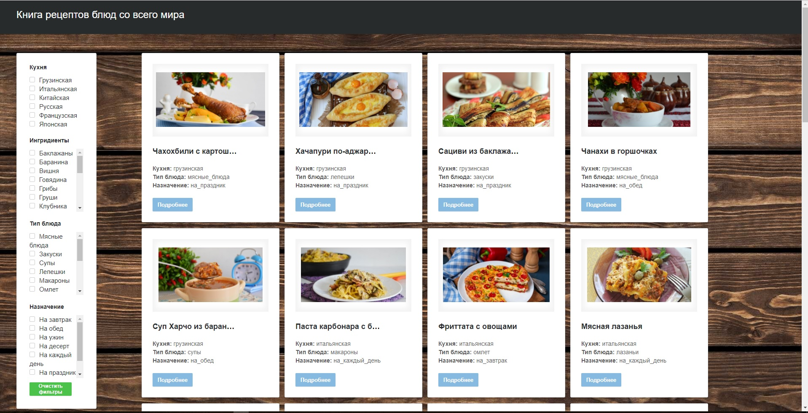

# Команда 1702-А
# Проект: "Книга рецептов блюд со всего мира"

# Требования к SPA приложению: 
1. Приложение должно представлять из себя хорошо оформленную базу данных с различными блюдами, их описанием, ингредиентами и пошаговым рецептом приготовления. 
2. В приложении должен осуществляться фильтр по национальным блюдам, ингредиентам и типам блюда. 
3. При нажатии на блок с блюдом должно открываться описание блюда, его изображение, ингредиенты и пошаговый рецепт с картинками. 
4. Вверху окна приложения должен быть закреплённый банер, при нажатии на который происходит переход на начало страницы. 
5. Слева окна приложения должен быть закреплённый банер с параметрами выбора фильтров по кухне, ингредиентам и типу блюда. 

# Роли:
* ПП, СП | [Тюленёва И.А.](https://stankin.github.io/inet-2017/idm-17-02/Tyuleneva_IA/index.html)
* ПП, АД | [Кузьмин А.А.](https://stankin.github.io/inet-2017/idm-17-02/Kuzmin_AA/index.html)
* КО     | [Игнатов А.Д.](https://stankin.github.io/inet-2017/idm-17-02/Ignatov_AD/index.html)
* РП, НИ | [Казаков И.М.](https://stankin.github.io/inet-2017/idm-17-02/Kazakov_IM/index.html)
* БА, ВН | [Астахов И.А.](https://stankin.github.io/inet-2017/idm-17-02/Astahov_IA/index.html)
